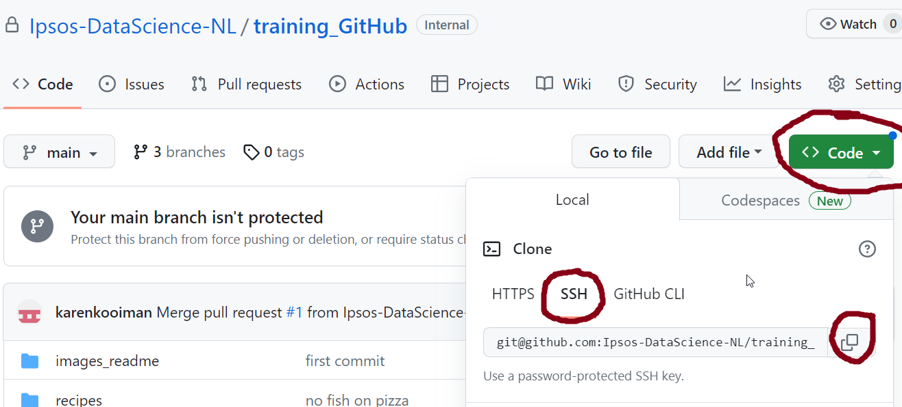
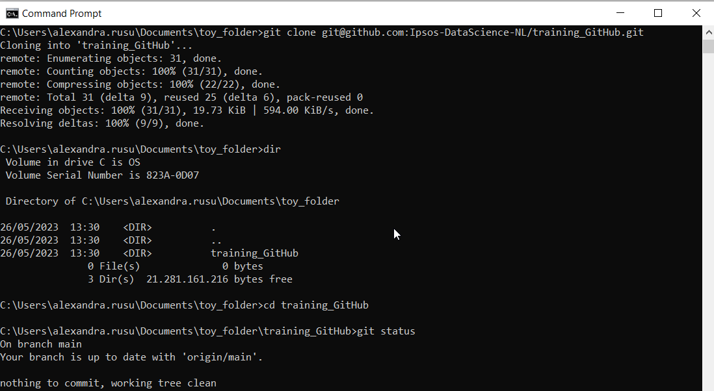
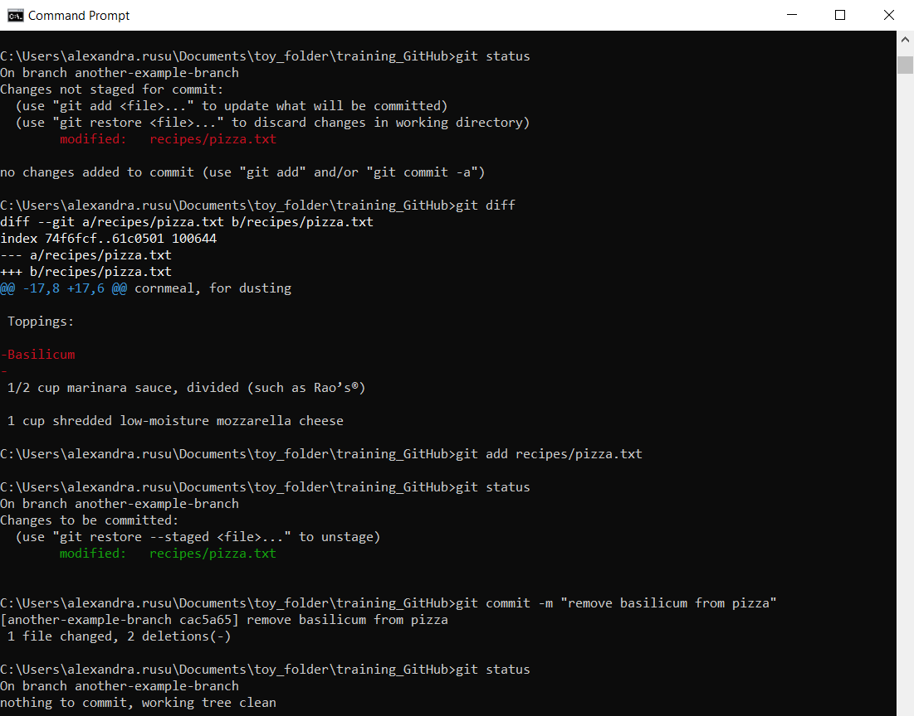
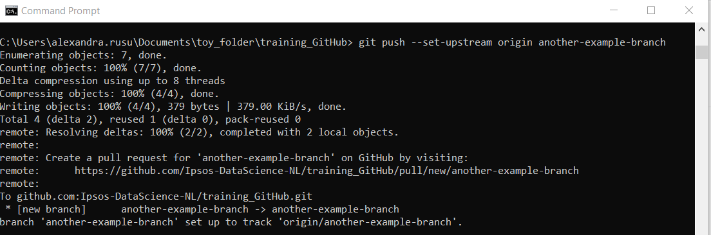

# GitHub training for the data teams

For this we will use *GitBash* or *Command Prompt*.

## How to navigate to your folder in CLI:
- `cd` stands for `change directory`
- with `cd <path\to\folder>` you can navigate to the folder you specified
- `cd` will take you to the root folder
- `cd ..` will take you to the parent folder
- `dir` will show you a list of the objects in the current folder
- `mkdir <name>` makes a new folder with the specified name

## A summary of how git works
&nbsp; 

## Git commands
- `git init` - transforms your current folder into a repository
- `git clone <path-to-remote-repository>` - makes a local copy of the remote repository
- `git pull`- updates the local repository with the information from the remote
- `git branch` - shows you on which branch you are
- `git branch <branchname>` - makes a new branch with the specified name
- `git checkout <branchname>` - checks out the specified branch (you are now working on that branch)
- `git checkout -b <branchname>` - makes a new branch and checks it out (you are now working on the new branch)
- `git status` - shows what files and folders were changes/added/removed
- `git diff` - shows what code was changed, this might need some scrolling. To exit, type *q*
- `git stash` - stashes the changes you made since the last commit; you can retrieve them later if needed
- `git add <files_to_be_added>` -  adds files to the index; the changes are tracked now
- `git add .` - adds all files and folders to the index
- `git commit -m <"commit message">` - commits changes to the local repository; you just saved a snapshot of your work
- `git commit -a -m <"commit message">` - adds changes of already tracked files to the index and commits them; new files will not be added
- `git push` - pushes the latest commit to the remote repository; everyone with access to the repository can see your code now

## Cloning a repository

In the browser, go to the repository on GitHub, click on the Code button, and copy the string under `SSH`
&nbsp; 
&nbsp; 

&nbsp; 
&nbsp; 
Open a CLI window and navigate to the folder where you want to clone the repository
&nbsp; 
&nbsp; 

&nbsp; 
&nbsp; 
Write  `git clone <path-to-remote-repository>`
&nbsp; 
Now the repository is in the destination folder, and you can navigate into it
&nbsp; 
&nbsp; 

&nbsp; 

## Working on a branch
It is always a good idea to not work on `main` when you make changes to the code. That way, the production is not affected while you develop, experiment and test your code. This is why you need to create a branch or check out an existing one. 

You create a new branch by writing `git branch <name-of-branch>` in your CLI. 
&nbsp; 
You can check what branches exist and on which one you are at the moment by calling `git branch`. 
&nbsp; 
You move to an exsting branch by writing `git chekout <name-of-branch>`
&nbsp; 
You also can create and directly move to the new branch by calling `git checkout -b <name-of-branch>` (notice the `-b`)
&nbsp; 
&nbsp; 

&nbsp; 

## Tracking your work
As soon as you save changes to files tracked in the repository, git notices them. However, they are not added to the index yet. You can always check where you stand by calling `git status`.

First, you need to add the changed files to the index. You are hereby staging them for commit. You can either stage a file or subfolder with `git add <path/to/file/or/folder>`, or stage all new changes with `git add .`

&nbsp; 

&nbsp; 
The changes are now saved in your local repository (you saved a snapshot of your work), but they are only on your machine. You will need to `push` them to GitHub in order to be visible in the remote repository. When you are pushing a new branch for the first time, you need to call `git push --set-upstream origin <name-of-branch>`. The rest of the time, `git push` will do the trick.

&nbsp; 

&nbsp; 

## Making a pull request

## Resolving conflicts

## Reviewing a pull request

## Merging a pull request