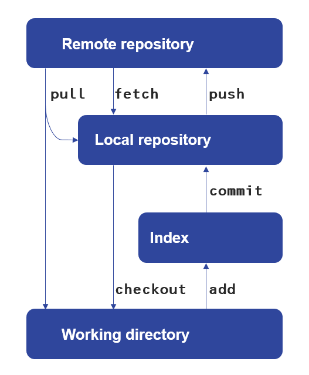

# GitHub training for the data teams

For this we will use *GitBash* or *Command Prompt*.

## How to navigate to your folder in bash:
- `cd` stands for `change directory`
- with `cd <path\to\folder>` you can navigate to the folder you specified
- `cd` will take you to the root folder
- `cd ..` will take you to the parent folder
- `dir` will show you a list of the objects in the current folder
- `mkdir <name>` makes a new folder with the specified name

## A summary of how git works
&nbsp; 

## Git commands
- `git init` - transforms your current folder into a repository
- `git clone <path-to-remote-repository>` - makes a local copy of the remote repository
- `git pull`- updates the local repository with the information from the remote
- `git branch` - shows you on which branch you are
- `git branch <branchname>` - makes a new branch with the specified name
- `git checkout <branchname>` - checks out the specified branch (you are now working on that branch)
- `git checkout -b <branchname>` - makes a new branch and checks it out (you are now working on the new branch)
- `git status` - shows what files and folders were changes/added/removed
- `git diff` - shows what code was changed, this might need some scrolling. To exit, type *q*
- `git stash` - stashes the changes you made since the last commit; you can retrieve them later if needed
- `git add <files_to_be_added>` -  adds files to the index; the changes are tracked now
- `git add .` - adds all files and folders to the index
- `git commit -m <"commit message">` - commits changes to the local repository; you just saved a snapshot of your work
- `git commit -a -m <"commit message">` - adds changes of already tracked files to the index and commits them; new files will not be added
- `git push` - pushes the latest commit to the remote repository; everyone with access to the repository can see your code now

## Creating a new branch

## Making a pull request

## Reviewing a pull request

## Merging a pull request