# GitHub training for the data teams

For this we will use *GitBash* or *Command Prompt*.

## How to navigate to your folder in CLI:
- `cd` stands for `change directory`
- with `cd <path\to\folder>` you can navigate to the folder you specified
- `cd` will take you to the root folder
- `cd ..` will take you to the parent folder
- `dir` will show you a list of the objects in the current folder
- `mkdir <name>` makes a new folder with the specified name

## A summary of how git works
&nbsp; 

## Git commands
- `git init` - transforms your current folder into a repository
- `git clone <path-to-remote-repository>` - makes a local copy of the remote repository
- `git pull`- updates the local repository with the information from the remote
- `git branch` - shows you on which branch you are
- `git branch <branchname>` - makes a new branch with the specified name
- `git checkout <branchname>` - checks out the specified branch (you are now working on that branch)
- `git checkout -b <branchname>` - makes a new branch and checks it out (you are now working on the new branch)
- `git status` - shows what files and folders were changes/added/removed
- `git diff` - shows what code was changed, this might need some scrolling. To exit, type *q*
- `git stash` - stashes the changes you made since the last commit; you can retrieve them later if needed
- `git add <files_to_be_added>` -  adds files to the index; the changes are tracked now
- `git add .` - adds all files and folders to the index
- `git commit -m <"commit message">` - commits changes to the local repository; you just saved a snapshot of your work
- `git commit -a -m <"commit message">` - adds changes of already tracked files to the index and commits them; new files will not be added
- `git push` - pushes the latest commit to the remote repository; everyone with access to the repository can see your code now

## Cloning a repository

In the browser, go to the repository on GitHub, click on the Code button, and copy the string under `SSH`
&nbsp; 
&nbsp; 

&nbsp; 
&nbsp; 
Open a CLI window and navigate to the folder where you want to clone the repository
&nbsp; 
&nbsp; 

&nbsp; 
&nbsp; 
Write  `git clone <path-to-remote-repository>`
&nbsp; 
Now the repository is in the destination folder, and you can navigate into it
&nbsp; 
&nbsp; 

&nbsp; 

## Working on a branch
It is always a good idea to not work on `main` when you make changes to the code. That way, the production is not affected while you develop, experiment and test your code. This is why you need to create a branch or check out an existing one. 

You create a new branch by writing `git branch <name-of-branch>` in your CLI. 
&nbsp; 
You can check what branches exist and on which one you are at the moment by calling `git branch`. 
&nbsp; 
You move to an exsting branch by writing `git chekout <name-of-branch>`
&nbsp; 
You also can create and directly move to the new branch by calling `git checkout -b <name-of-branch>` (notice the `-b`)
&nbsp; 
&nbsp; 

&nbsp; 

## Working in the local repository
Before you change code:
1. Make sure you are on the right branch by calling `git branch` or `git status`
2. Make sure you have the latest version of the code by doing `git pull`

## Tracking your work
As soon as you save changes to files tracked in the repository, git notices them. However, they are not added to the index yet. You can always check where you stand by calling `git status`.

First, you need to add the changed files to the index. You are hereby staging them for commit. You can either stage a file or subfolder with `git add <path/to/file/or/folder>`, or stage all new changes with `git add .` (notice the dot)

Then you can commit them to the local repository with the `git commit` command. A commit is a point in the history of your work to which you can travel back. Therefore it is good practice to have a very informative commit message. This way you can find the work you want to revert to easily. Type `git commit -m <"an informative commit message">`.Also it is better to commit only a few related changes at the same time.
&nbsp; 
You can also do everything in one go by calling `git commit -a -m <"an informative commit message">` (notice the `-a`, standing for add). This will only work if you want to stage and commit files that are already being tracked. If you created new files, you will need to call the `git add` command before you do `git commit`.
&nbsp; 
&nbsp; 

&nbsp; 
The changes are now saved in your local repository (you saved a snapshot of your work), but they are only on your machine. You will need to `push` them to GitHub in order to be visible in the remote repository. When you are pushing a new branch for the first time, you need to call `git push --set-upstream origin <name-of-branch>`. The rest of the time, `git push` will do the trick.

&nbsp; 

&nbsp; 

## Making a pull request
When your branch is ready and you want to make it part of the production code, you make a pull request. We do this on github, in the browser. Go to the page of your repository and click on `branches`.
&nbsp; 
&nbsp; 
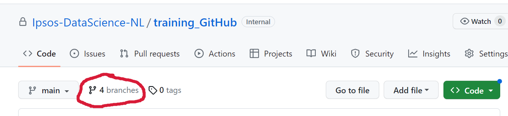
&nbsp; 
&nbsp; 
This will take you to a list of branches. Click `New pull request` for the branch you want to submit for review.
&nbsp; 
&nbsp; 

&nbsp; 
&nbsp; 
In the next screen you can ask for reviewers, and create the pull request.
&nbsp; 
&nbsp; 
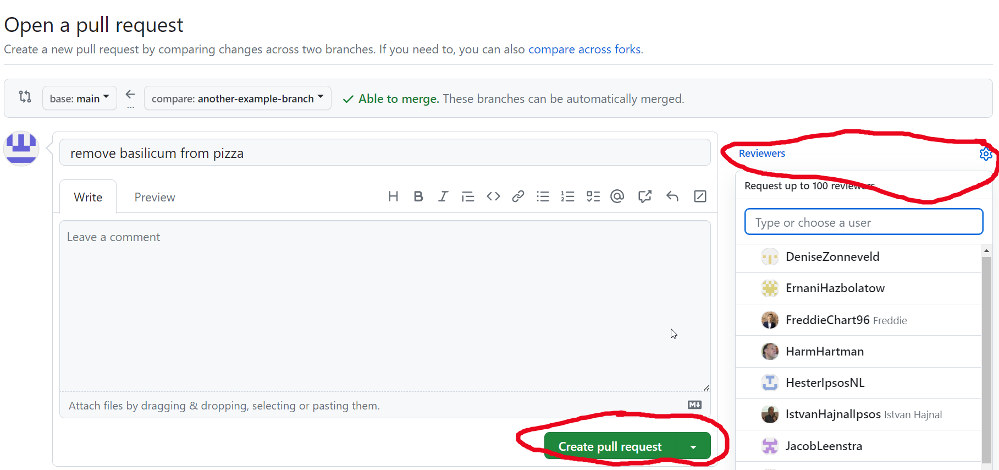
&nbsp; 

## Reviewing a pull request
On the main page of your repository, click on `Pull requests`.
&nbsp; 
&nbsp; 
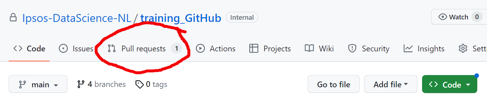
&nbsp; 
&nbsp; 
Select the pull request
&nbsp; 
&nbsp; 
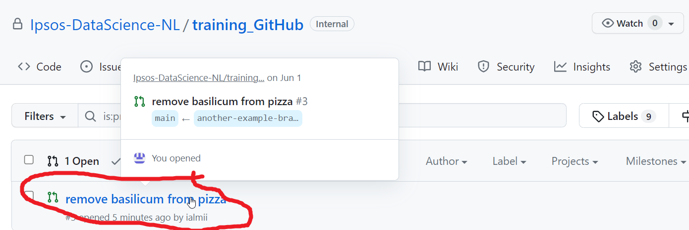
&nbsp; 
&nbsp; 
You can first look at `Files changed`.
&nbsp; 
&nbsp; 
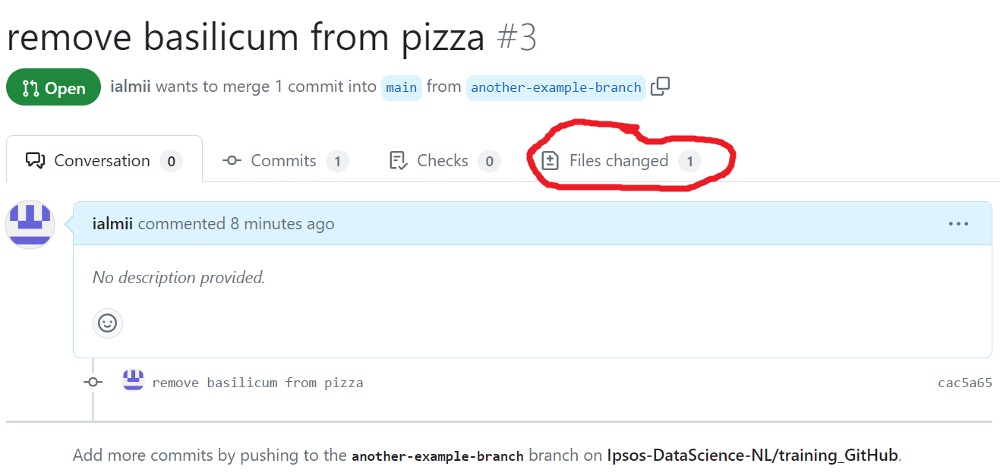
&nbsp; 
&nbsp; 
Here you can see how many lines of code were deleted and added, and you can add comments by clicking on the `+` sign.
&nbsp; 
&nbsp; 
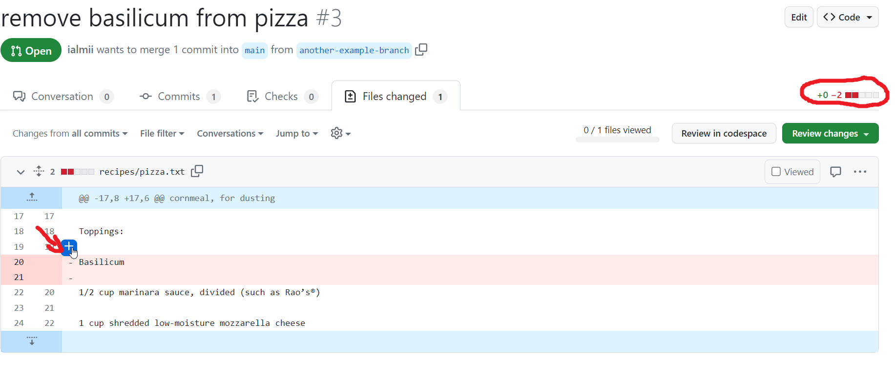
&nbsp; 
&nbsp; 
When you add the first comment, you can `Start a review`. This means that all the comments in this review will be `Pending` until you submit the review. The author receives the whole review at once.
&nbsp; 
&nbsp; 
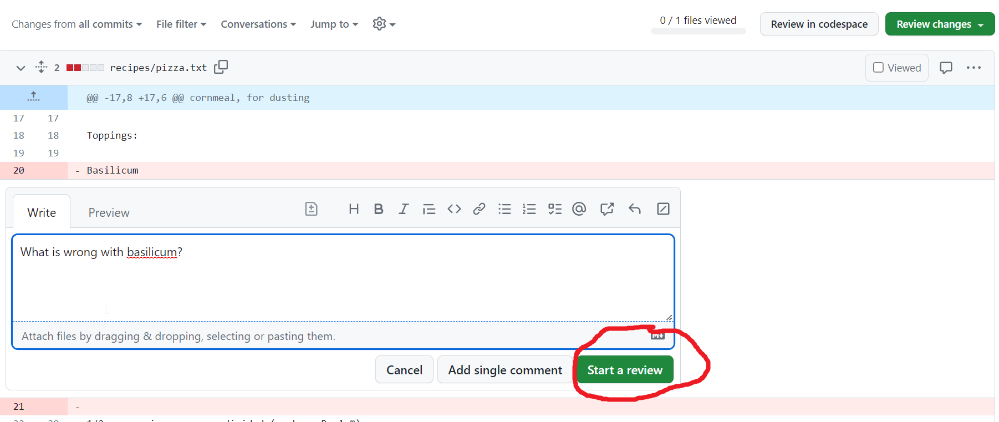
&nbsp; 
&nbsp; 
When you are finished adding your comments, you can `Finish your review` and decide whether to `Approve`, `Request changes`, or just `Comment`. In some cases, one or several approving reviews are necessary in order to be able to merge a pull request. Authors cannot submit approving reviews, but they can merge their own pull requests, once all conditions are met.
&nbsp; 
&nbsp; 
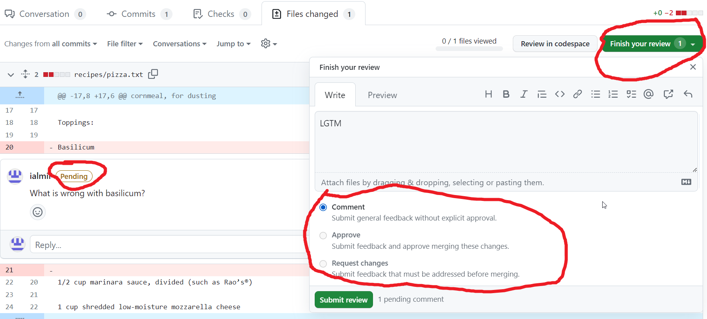
&nbsp; 
&nbsp; 

## Resolving conflicts
Sometimes, there are conflicts between the changes in the new pull request, and the changes made on the main branch in the meantime. You will not be able to merge a pull request without resolving the conflicts.
On the page of the pull request, you have to scroll down a bit, until you reach the summary of the pull request. Here you can see that conflicts have been detected and that the `Merge pull request` button is inactive.
&nbsp; 
&nbsp; 
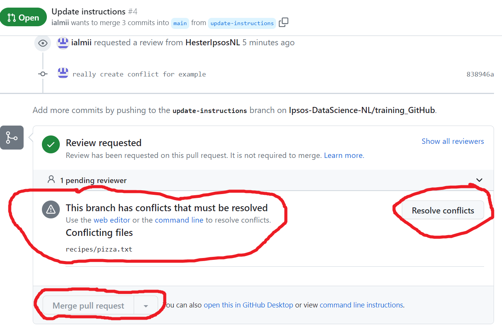
&nbsp; 
&nbsp; 
Clicking on `Resolve conflicts` will take you to a page where you can see the conflicting lines of code. Conflicts appear when the same line(s) of code were changed simultaneously*.
&nbsp; 
*simultaneously means, in this case, that while we were working on a branch, the main branch was changed at the same location.
&nbsp; 
&nbsp; 
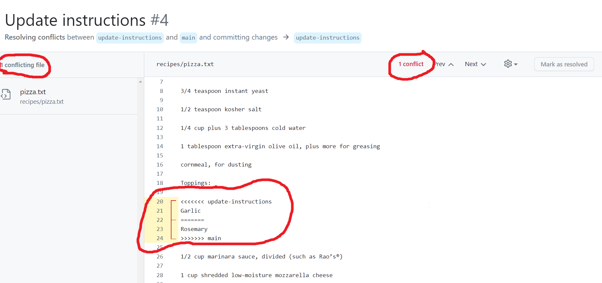
&nbsp; 
&nbsp; 
Keep the changes you think are appropriate, and then `Mark as resolved`. You will need to `Commit merge` so that the branch now tracks a snapshot of this change. 
&nbsp; 
&nbsp; 
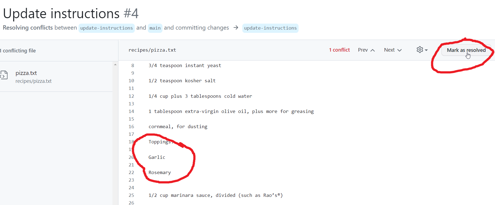
&nbsp; 
&nbsp; 
After resolving conflicts, it is always a good idea to do a `git pull` in your local repository, so that the changes you made in the browser are tracked in your local repository as well.
&nbsp; 
&nbsp; 
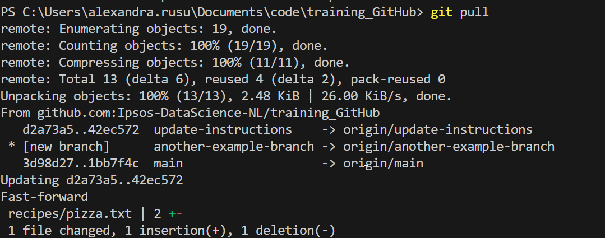
&nbsp; 
&nbsp; 
## Merging a pull request
Go to the page of the pull request as described above, scroll down until you reach the `Merge pull request` button, and if all conditions are met, you can click on the button. After that click `Confirm merge`.
&nbsp; 
&nbsp; 
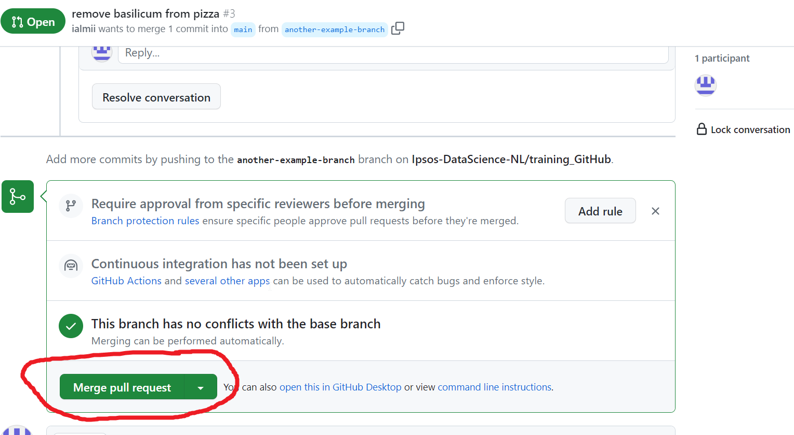
&nbsp; 
&nbsp; 